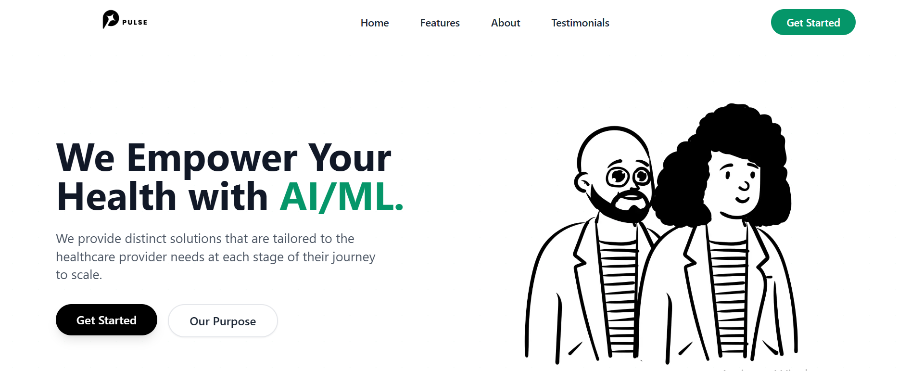

# Pulse - AI-Driven Remote Patient Monitoring and Predictive Health Analysis

<div align="center">
  
</div>

<div align="center">
  
  
  
  
</div>

## 📋 Overview

Pulse is an innovative healthcare platform that leverages AI technology to provide remote patient monitoring and predictive health analysis. The system connects patients with healthcare providers through a modern, responsive interface that prioritizes user experience and accessibility.

## 🚀 Features

- **Real-time Patient Monitoring**: Track vital signs and health metrics remotely
- **Video Consultations**: Secure video calls between patients and doctors using Twilio
- **AI-Powered Analytics**: Predictive health analysis to identify potential issues
- **Interactive Dashboard**: Comprehensive view of patient health data
- **Responsive Design**: Seamless experience across all devices
- **User Role Management**: Different interfaces for patients, doctors, and administrators

## 💻 Technologies

### Frontend
- **Next.js**: React framework for server-rendered applications
- **React**: JavaScript library for building user interfaces
- **TailwindCSS**: Utility-first CSS framework
- **TypeScript**: Typed JavaScript for better development experience
- **Framer Motion**: Animation library for React
- **Radix UI**: Unstyled, accessible UI components
- **React Hook Form**: Form validation library
- **Zod**: TypeScript-first schema validation
- **DaisyUI**: Component library for TailwindCSS

### Backend & Services
- **Prisma**: Next-generation ORM for Node.js and TypeScript
- **Twilio**: API for video and chat functionality
- **Axios**: Promise-based HTTP client

## 🏗️ Project Structure

```
/app                  # Next.js app directory (pages and routes)
/components           # Reusable UI components
  /ui                 # Core UI components (buttons, forms, etc.)
  /doctor             # Doctor-specific components
  /patient            # Patient-specific components
/contexts             # React context providers
/hooks                # Custom React hooks
/lib                  # Utility functions and libraries
/services             # API and external service integrations
/styles               # Global styles and Tailwind configuration
/public               # Static assets
```

## 👥 Team

- **Frontend Developer**: Implemented the responsive UI using React, Next.js, and TailwindCSS
- **Backend Developer**: Built the API and database infrastructure
- **UI/UX Designer**: Created the visual design and user experience
- **Project Manager**: Coordinated development and feature prioritization

## 🔧 Getting Started

### Prerequisites
- Node.js (v18+)
- npm or yarn

### Installation

```bash
# Clone the repository
git clone https://github.com/yourusername/pulse.git

# Navigate to the project directory
cd pulse/Health-Care/healthcb

# Install dependencies
npm install

# Start the development server
npm run dev
```


## 📄 License

This project is licensed under the MIT License - see the LICENSE file for details.
